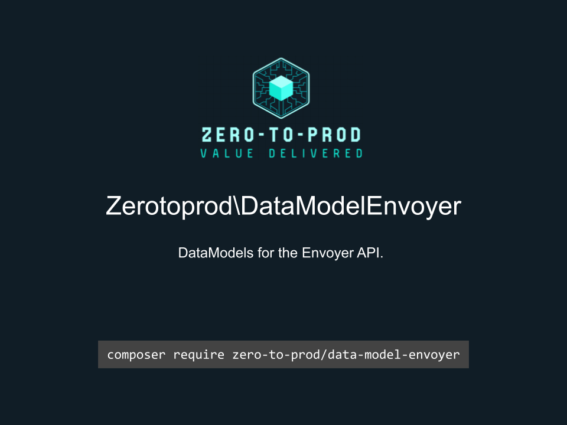

# Zerotoprod\DataModelEnvoyer



[](https://github.com/zero-to-prod/data-model-envoyer)
[](https://github.com/zero-to-prod/data-model-envoyer/actions)
[](https://packagist.org/packages/zero-to-prod/data-model-envoyer/stats)
[](https://packagist.org/packages/zero-to-prod/data-model-envoyer/stats)
[](https://packagist.org/packages/zero-to-prod/data-model-envoyer)
[](https://github.com/zero-to-prod/data-model/blob/main/LICENSE.md)
[](https://wakatime.com/badge/github/zero-to-prod/data-model-envoyer)
[](https://hitsofcode.com/github/zero-to-prod/data-model-envoyer/view?branch=main)

## Contents
- [Introduction](#introduction)
- [Installation](#installation)
  - [Publishing Files](#publishing-files)
- [DataModels](#datamodels)
- [Local Development](#local-development)
  - [Prerequisites](#prerequisites)
  - [Initializing](#initializing)
  - [Testing](#testing)
  - [Configuration](#configuration)
- [Contributing](#contributing)

## Introduction

This package offers typed classes for [Envoyer API](https://envoyer.io/api-documentation) request and response objects.

## Installation

You can install this package via composer:
```shell
composer require zero-to-prod/data-model-envoyer
```

### Publishing Files
You can directly import these files into your project like this:
```shell
./vendor/bin/data-model-envoyer ./app/DataModels App\\DataModels
```
The first argument is the destination and the second is the namespace.

## DataModels

- [ProjectResponse](https://envoyer.io/api-documentation#list-projects) `\Zerotoprod\DataModelEnvoyer\ProjectResponse::from();`
- [Project](https://envoyer.io/api-documentation#get-project) `\Zerotoprod\DataModelEnvoyer\Project::from();`
- [CreateProject](https://envoyer.io/api-documentation#get-project) `\Zerotoprod\DataModelEnvoyer\CreateProject::from();`
- [UpdateProject](https://envoyer.io/api-documentation#update-project) `\Zerotoprod\DataModelEnvoyer\UpdateProject::from();`
- [UpdateProjectSource](https://envoyer.io/api-documentation#update-project-source) `\Zerotoprod\DataModelEnvoyer\UpdateProjectSource::from();`
- [GetLinkedFolders](https://envoyer.io/api-documentation#get-linked-folders) `\Zerotoprod\DataModelEnvoyer\GetLinkedFolders::from();`
- [Folder](https://envoyer.io/api-documentation#create-linked-folder) `\Zerotoprod\DataModelEnvoyer\Folder::from();`
- [Servers](https://envoyer.io/api-documentation#list-servers) `\Zerotoprod\DataModelEnvoyer\Servers::from();`
- [Server](https://envoyer.io/api-documentation#get-server) `\Zerotoprod\DataModelEnvoyer\Server::from();`
- [CreateServer](https://envoyer.io/api-documentation#create-server) `\Zerotoprod\DataModelEnvoyer\CreateServer::from();`
- [UpdateServer](https://envoyer.io/api-documentation#update-server) `\Zerotoprod\DataModelEnvoyer\UpdateServer::from();`
- [GetEnvironment](https://envoyer.io/api-documentation#get-environment) `\Zerotoprod\DataModelEnvoyer\GetEnvironment::from();`
- [Environment](https://envoyer.io/api-documentation#get-environment) `\Zerotoprod\DataModelEnvoyer\Environment::from();`
- [EnvironmentServers](https://envoyer.io/api-documentation#get-environment-servers) `\Zerotoprod\DataModelEnvoyer\EnvironmentServers::from();`
- [UpdateEnvironment](https://envoyer.io/api-documentation#update-environment) `\Zerotoprod\DataModelEnvoyer\UpdateEnvironment::from();`
- [ResetEnvironment](https://envoyer.io/api-documentation#reset-environment-key) `\Zerotoprod\DataModelEnvoyer\ResetEnvironment::from();`
- [Actions](https://envoyer.io/api-documentation#actions) `\Zerotoprod\DataModelEnvoyer\Actions::from();`
- [Action](https://envoyer.io/api-documentation#actions) `\Zerotoprod\DataModelEnvoyer\Action::from();`
- [Hooks](https://envoyer.io/api-documentation#list-hooks) `\Zerotoprod\DataModelEnvoyer\Hooks::from();`
- [Hook](https://envoyer.io/api-documentation#get-hook) `\Zerotoprod\DataModelEnvoyer\Hook::from();`
- [CreateHook](https://envoyer.io/api-documentation#create-hook) `\Zerotoprod\DataModelEnvoyer\CreateHook::from();`
- [UpdateHook](https://envoyer.io/api-documentation#update-hook) `\Zerotoprod\DataModelEnvoyer\UpdateHook::from();`
- [Deployments](https://envoyer.io/api-documentation#list-deployments) `\Zerotoprod\DataModelEnvoyer\Deployments::from();`
- [Deployment](https://envoyer.io/api-documentation#get-deployment) `\Zerotoprod\DataModelEnvoyer\Deployment::from();`
- [DeployProject](https://envoyer.io/api-documentation#deploy-project) `\Zerotoprod\DataModelEnvoyer\DeployProject::from();`
- [HeartBeats](https://envoyer.io/api-documentation#list-heartbeats) `\Zerotoprod\DataModelEnvoyer\HeartBeats::from();`
- [HeartBeat](https://envoyer.io/api-documentation#get-heartbeat) `\Zerotoprod\DataModelEnvoyer\HeartBeat::from();`
- [CreateHeartBeat](https://envoyer.io/api-documentation#create-heartbeat) `\Zerotoprod\DataModelEnvoyer\CreateHeartBeat::from();`
- [Collaborators](https://envoyer.io/api-documentation#list-collaborators) `\Zerotoprod\DataModelEnvoyer\Collaborators::from();`
- [Collaborator](https://envoyer.io/api-documentation#get-collaborator) `\Zerotoprod\DataModelEnvoyer\Collaborator::from();`
- [CreateCollaborator](https://envoyer.io/api-documentation#create-collaborator) `\Zerotoprod\DataModelEnvoyer\CreateCollaborator::from();`
- [DeleteCollaborator](https://envoyer.io/api-documentation#delete-collaborator) `\Zerotoprod\DataModelEnvoyer\DeleteCollaborator::from();`
- [Notifications](https://envoyer.io/api-documentation#list-notifications) `\Zerotoprod\DataModelEnvoyer\Notifications::from();`
- [Notification](https://envoyer.io/api-documentation#get-notification) `\Zerotoprod\DataModelEnvoyer\Notification::from();`
- [CreateNotification](https://envoyer.io/api-documentation#create-notification) `\Zerotoprod\DataModelEnvoyer\CreateNotification::from();`
- [UpdateNotification](https://envoyer.io/api-documentation#update-notification) `\Zerotoprod\DataModelEnvoyer\UpdateNotification::from();`

## Local Development

This project provides a convenient [dock](https://github.com/zero-to-prod/dock) script to simplify local development workflows within Docker containers.

You can use this script to initialize the project, manage Composer dependencies, and run tests in a consistent PHP environment.

### Prerequisites

- Docker installed and running
- A `.env` file (created automatically via the `dock init`z command, if it doesn’t already exist)

### Initializing

Use the following commands to set up the project:

```shell
sh dock init
sh dock composer update
```

### Testing

This command runs PHPUnit inside the Docker container, using the PHP version specified in your `.env` file.
You can modify or extend this script to include additional tests or commands as needed.

```shell
sh dock test
```

Run the test suite with all versions of php:

```shell
sh test.sh
```

### Configuration

Before starting development, verify that your `.env` file contains the correct settings.

You can specify which PHP version to use for local development, debugging, and Composer operations by updating these variables in your `.env` file:

```dotenv
PHP_VERSION=7.1
PHP_DEBUG=7.1
PHP_COMPOSER=7.1
```

Make sure these values reflect the PHP versions you intend to use.
If the `.env` file does not exist, run the `sh dock init` command to create one from the `.env.example` template.

## Contributing

Contributions, issues, and feature requests are welcome!
Feel free to check the [issues](https://github.com/zero-to-prod/data-model-envoyer/issues) page if you want to contribute.

1. Fork the repository.
2. Create a new branch (`git checkout -b feature-branch`).
3. Commit changes (`git commit -m 'Add some feature'`).
4. Push to the branch (`git push origin feature-branch`).
5. Create a new Pull Request.